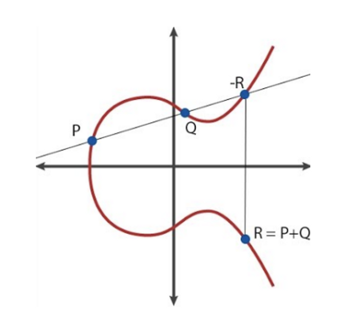
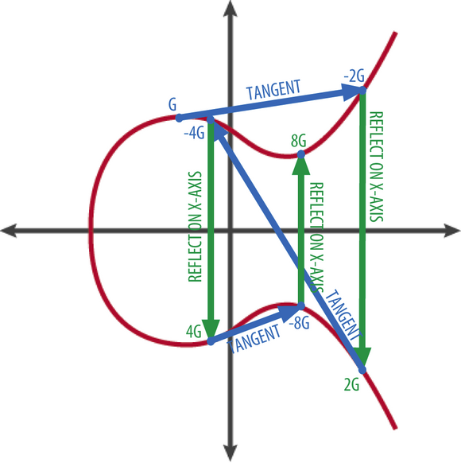

## Elliptic Curve Cryptography (ECC)
Private Key -> Public Key
Elliptic curves are symmetric about the x-axis
Finite field & additive group
+ $R = P + Q$
- Draw a line through $P$ and $Q$, The third intersection point with the curve is $-R$. Then reflect $-R$ across the x-axis to get the result of the addition, which is $R$
- When $P$ and $Q$ are the same point, draw the tangent between the point and the elliptic curve. The second intersection point with the elliptic curve is $-R$. Then reflect $-R$ across the x-axis to get $R$
- The intersection point $-R$ must exist
- An identity element 0 is defined as the point as infinity



Generator $G$
Cyclic group $[0]G, G, [2]G, ... [q-1]G$ 
$K = k * G$

- Easy to compute $K$ with pre-computed $[2^n]G$
- Given $K$ and $G$, it is hard to get $k$



## ECDSA
Alice has private key $d \in \mathbb{F}_q$, hash of message $m$ is $z$

```
+-----------------------------+                +-------------------------+
|       Alice                 |                |          Bob            |
|                             |                |                         |
|                             |                |                         |
|  private: d                 |                |                         |
|                             |                |                         |
|   public: PK=d*G            |                |    public: PK           |
|                             |                |                         |
|           h=Hash(m)         |                |            h=Hash(m)    |
|                             |                |                         |
|   random: k                 |                |                         |
|                             |                |                         |
|           R=k*G             |                |                         |
|                             |                |                         |
|           r=Rx %q           |                |                         |
|                             |                |                         |
|           s=(h+r*d)/k %q +------- (r,s) -------> verify:               |
|                             |                |                         |
|                             |                |      R'=h/s*G+r/s*PK    |
|                             |                |                         |
|                             |                |      r ?= R'x %q        |
+-----------------------------+                +-------------------------+
```

Workflow
- Alice: choose a random $k$ and compute
$$\begin{aligned}
R &= k*G \\
r &= R_x \mod{q} \\
s &= (h+r*d)/k \mod{q}
\end{aligned}$$
- Alice: generate proof $(r,s)$
- Bob: compute $R,R^{\prime}$ from $r$ and the elliptic curve
- Bob: verify
$$\begin{aligned}
R^{\prime} &= h/s*G+r/s*PK \\
r &\overset{\text{?}}{=} R^{\prime}_x
\end{aligned}$$
Risk of private key leakage
+ Require that $k$ has to be random.,otherwise Bob may deduce private key $d$
	+ Alice uses the same $k$ twice and compute $s,s^{\prime}$
	+ Bob can deduce $k$ through $k=(h_1-h_2)/(s_1-s_2)$ 
	+ Bob then can deduce private key $d$ through $d=(s_1*k-h_1)/r$

$$\begin{aligned}
s_1 &= (h_1+r*d)/k \\
s_2 &= (h_2+r*d)/k \\
\end{aligned}$$